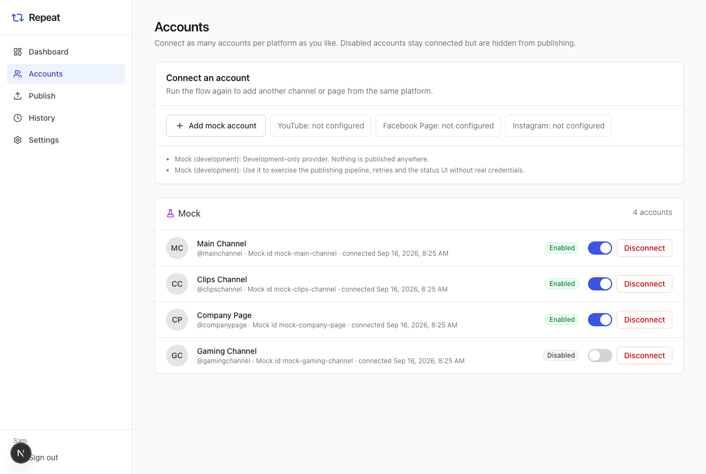
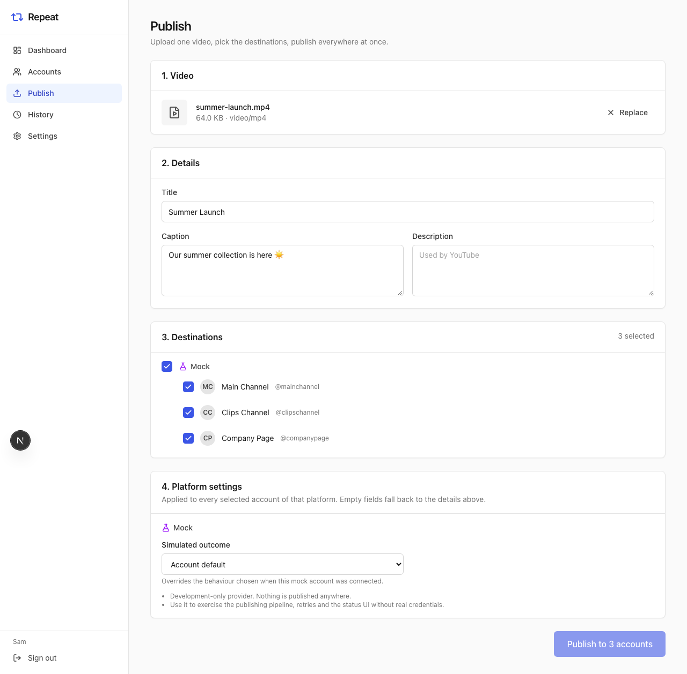
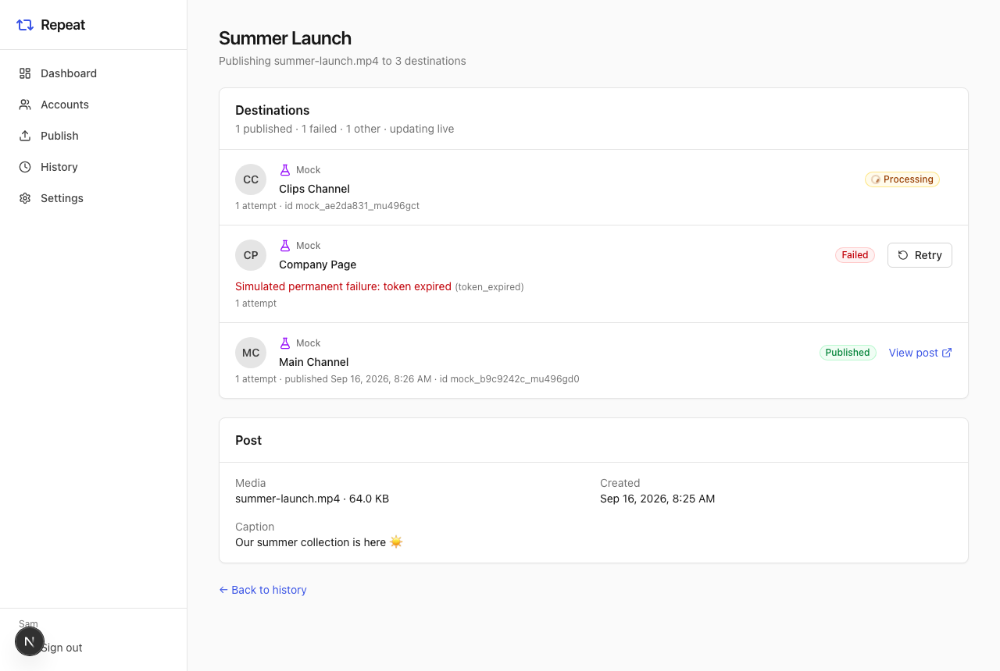
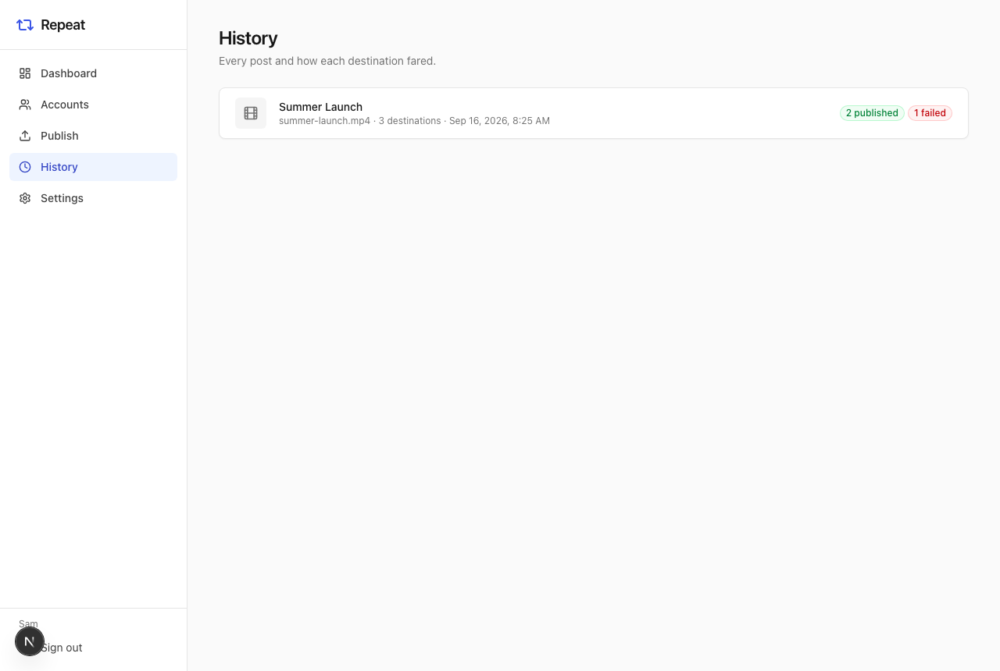

# Repeat

**Repeat is an open-source, self-hosted application for publishing one piece of content to multiple connected social-media accounts at once.**

Upload a video (or images for an Instagram post or carousel), tick the accounts it should go to, press **Publish**. Repeat creates an independent publishing job per destination, uploads through each platform's official API, tracks every destination separately, and lets you retry just the ones that failed.

- Connect **any number of accounts**, including several from the same platform (three YouTube channels, two Instagram accounts, four Facebook Pages...). No artificial limits.
- Per-post destination selection, with platform-specific options (YouTube privacy/category, Instagram caption...). Accounts whose platform can't take the chosen media (say, YouTube and a photo) are greyed out with the reason.
- Instagram image posts and carousels of up to 10 images and videos.
- One failure never affects the others. Retryable errors back off and retry automatically; permanent ones are surfaced clearly with a **Retry** button.
- Official APIs only: YouTube Data API v3, Meta Graph API (Facebook Pages, Instagram professional accounts), TikTok Content Posting API. No scraping, no private endpoints.
- Provider adapters are isolated behind a small interface so X, LinkedIn, Threads, Bluesky, Pinterest... can be added without touching the publishing engine.
- OAuth tokens encrypted at rest (AES-256-GCM), database-backed sessions, CSRF protection, streamed uploads with validation.

> Status: **V1 self-hosted release.** Hosted/cloud, mobile apps, teams, scheduling and analytics are deliberately out of scope for now; the architecture leaves room for them (see [docs/architecture.md](docs/architecture.md)).

## Screenshots

| Accounts                                                                                                  | Publish                                                                                                  |
| --------------------------------------------------------------------------------------------------------- | -------------------------------------------------------------------------------------------------------- |
|  |  |

| Live status                                                                                                             | History                                                                      |
| ----------------------------------------------------------------------------------------------------------------------- | ---------------------------------------------------------------------------- |
|  |  |

_Captured with the development-only mock provider, which simulates success, processing and failures without touching a real platform._

## Supported platforms

| Platform      | What Repeat publishes                                                         | Account requirements                                                            | Notes                                                                                                                                                                                                                                                         |
| ------------- | ----------------------------------------------------------------------------- | ------------------------------------------------------------------------------- | ------------------------------------------------------------------------------------------------------------------------------------------------------------------------------------------------------------------------------------------------------------- |
| **YouTube**   | Videos (resumable upload, up to 256 GB / 12 h)                                | Any Google account with a YouTube channel; brand-account channels are supported | Google Cloud project with the YouTube Data API enabled. Unaudited projects upload as **private** only. ~1,600 quota units per upload of the default 10,000/day.                                                                                               |
| **Facebook**  | Videos to **Pages** (resumable upload, up to 10 GB / 4 h)                     | Facebook Page you manage                                                        | Personal profiles cannot be published to via the API. Needs `pages_manage_posts` (App Review for users outside your app roles).                                                                                                                               |
| **Instagram** | Reels (one video), image posts (one JPEG), **carousels** (2–10 images/videos) | Instagram **Business or Creator** account linked to a Facebook Page             | Personal accounts are not supported by Meta's API. Images must be JPEG (no PNG via the API), ≤ 8 MB, 4:5 to 1.91:1. Instagram downloads files from your server, so `APP_URL` must be a public HTTPS address. 100 API posts / 24 h (a carousel counts as one). |
| **TikTok**    | Videos via Direct Post (MP4/MOV/WebM, ≤ 4 GB, ≤ 10 min)                       | Any TikTok account that authorizes your app                                     | TikTok app with Login Kit + Content Posting API. HTTPS redirect URI required. **Unaudited apps post as "Only me" only**, to private accounts, max 5 accounts per 24 h.                                                                                        |
| **Mock**      | Nothing (simulation)                                                          | –                                                                               | Development-only provider that simulates success, processing, transient and permanent failures.                                                                                                                                                               |

Read [docs/providers.md](docs/providers.md) for the full list of platform restrictions and for how to add a new provider.

## Quick start (Docker Compose)

Requirements: Docker with Compose v2.

```bash
git clone https://github.com/your-org/repeat.git
cd repeat
cp .env.example .env
# set the two secrets (everything else has working defaults):
#   SESSION_SECRET=$(openssl rand -base64 48)
#   TOKEN_ENCRYPTION_KEY=$(openssl rand -base64 32)
docker compose up --build
```

Open <http://localhost:3000>, create the first user, connect accounts, publish.

What runs:

| Service   | Purpose                                                               |
| --------- | --------------------------------------------------------------------- |
| `db`      | PostgreSQL 16 — all state                                             |
| `redis`   | Redis 7 — job queue (BullMQ)                                          |
| `migrate` | one-shot container that applies database migrations, then exits       |
| `web`     | Next.js app: UI + HTTP API, port 3000                                 |
| `worker`  | background publisher; scale with `docker compose up --scale worker=3` |

Uploaded media lives in the `media` volume, database data in `postgres`. Restarting or rebuilding keeps everything.

Without provider credentials the app still boots; the Accounts page shows _YouTube: not configured_ / _Facebook: not configured_ and nothing can be connected yet. To try the whole pipeline without any credentials set `MOCK_PROVIDER_ENABLED=true` in `.env` and add mock accounts on the Accounts page.

## Configuration

Everything is configured through environment variables, validated at startup with a readable error listing what is missing. [`.env.example`](.env.example) documents every option; the important ones:

| Variable                                      | Required | Description                                                                                                                                           |
| --------------------------------------------- | -------- | ----------------------------------------------------------------------------------------------------------------------------------------------------- |
| `DATABASE_URL`                                | yes      | PostgreSQL connection string                                                                                                                          |
| `REDIS_URL`                                   | yes      | Redis connection string                                                                                                                               |
| `APP_URL`                                     | yes      | Public URL of this instance. OAuth callbacks and Instagram media URLs are built from it. Must be **HTTPS and publicly reachable** for real providers. |
| `SESSION_SECRET`                              | yes      | ≥ 32 random characters. Signs media URLs and protects sessions.                                                                                       |
| `TOKEN_ENCRYPTION_KEY`                        | yes      | 32-byte key (base64 or hex) encrypting stored OAuth tokens. Losing it means reconnecting every account.                                               |
| `ALLOW_REGISTRATION`                          | no       | `true` (default) lets anyone sign up. The first user can always register. Set `false` after creating your users.                                      |
| `MEDIA_STORAGE_DRIVER` / `MEDIA_STORAGE_PATH` | no       | `local` (default) stores files on disk. Relative paths resolve against the repository root; Compose uses `/data/media`.                               |
| `MAX_UPLOAD_SIZE_MB`                          | no       | Upload limit, default 2048. Enforced while streaming, not only from `Content-Length`.                                                                 |
| `WORKER_CONCURRENCY`                          | no       | Destinations published in parallel per worker process (default 2).                                                                                    |
| `GOOGLE_CLIENT_ID` / `GOOGLE_CLIENT_SECRET`   | no       | Enables YouTube.                                                                                                                                      |
| `META_APP_ID` / `META_APP_SECRET`             | no       | Enables Facebook Pages and Instagram. `META_GRAPH_API_VERSION` defaults to `v21.0`.                                                                   |
| `TIKTOK_CLIENT_KEY` / `TIKTOK_CLIENT_SECRET`  | no       | Enables TikTok.                                                                                                                                       |
| `MOCK_PROVIDER_ENABLED`                       | no       | Registers the development-only mock platform.                                                                                                         |
| `FFPROBE_PATH`                                | no       | Path to `ffprobe` if it is not on `PATH`.                                                                                                             |

### Why ffmpeg is in the image

`ffprobe` (part of ffmpeg) reads duration, width and height from uploads. Providers use that to reject media that would fail later (Instagram's 3 s – 15 min window, YouTube's 12 h limit) before spending an upload. Videos are **not** transcoded. If `ffprobe` is missing, uploads still work and those checks are skipped.

## Configuring YouTube (Google)

1. In [Google Cloud Console](https://console.cloud.google.com/) create a project and enable **YouTube Data API v3** (APIs & Services → Library).
2. Configure the **OAuth consent screen**: user type _External_, add the scopes `https://www.googleapis.com/auth/youtube.upload` and `https://www.googleapis.com/auth/youtube.readonly`. While the app is in _Testing_, add every Google account you want to connect as a **test user**.
3. Create an **OAuth client ID** of type _Web application_ with the authorized redirect URI
   `${APP_URL}/api/connect/google/callback` (for local development `http://localhost:3000/api/connect/google/callback`).
4. Put the client ID and secret in `.env` as `GOOGLE_CLIENT_ID` / `GOOGLE_CLIENT_SECRET` and restart.
5. On the Accounts page click **Connect YouTube**. Google's account chooser lets you pick a channel (including brand-account channels). Run it again to connect another channel.

Things to know:

- Apps in _Testing_ get refresh tokens that **expire after 7 days**; publish the consent screen to _Production_ to avoid reconnecting weekly. Publishing sensitive scopes triggers Google's verification process.
- Until your project passes the [YouTube API Services compliance audit](https://support.google.com/youtube/contact/yt_api_form), every video uploaded through it is forced to **private**.
- The default quota is 10,000 units/day; a video upload costs ~1,600, so roughly 6 uploads/day per project. Request more quota from Google if you need it. Repeat surfaces `quota_exceeded` as a permanent error you can retry the next day.
- Channels must be verified to upload videos longer than 15 minutes.

## Configuring Facebook Pages and Instagram (Meta)

Repeat uses Facebook Login and the Graph API. One "Connect Facebook / Instagram" flow discovers every Facebook Page you manage and every Instagram professional account linked to those Pages; you choose which to connect.

1. In [Meta for Developers](https://developers.facebook.com/) create an app (type _Business_), and add the **Facebook Login** product.
2. Under Facebook Login → Settings add the _Valid OAuth Redirect URI_
   `${APP_URL}/api/connect/meta/callback`. Meta requires HTTPS here except for `localhost`.
3. Copy the App ID and App Secret (Settings → Basic) to `.env` as `META_APP_ID` / `META_APP_SECRET`. (Optional but recommended: enable _Require App Secret_ — Repeat always sends `appsecret_proof`.)
4. Restart and click **Connect Facebook / Instagram** on the Accounts page.

Permissions requested: `pages_show_list`, `pages_read_engagement`, `pages_manage_posts`, `instagram_basic`, `instagram_content_publish`, `business_management`.

Things to know:

- **Development mode vs Live mode.** In development mode the permissions above work only for people with a role on the app (admins, developers, testers) and content is only visible to them. Going live requires **App Review** for every permission plus **Business Verification**. For a personal self-hosted instance where you only connect your own Pages, adding yourself as an app admin/tester is usually enough.
- **Facebook**: publishing is possible to **Pages only**. Personal profiles/timelines cannot be posted to through the API.
- **Instagram**: only **Business or Creator** accounts that are **linked to a Facebook Page** are discoverable and publishable. Personal accounts are not supported. Instagram fetches every file from a URL, so `APP_URL` must be public HTTPS (Repeat hands out time-limited signed URLs; nothing is publicly listable). Instagram enforces 100 API-published posts per account per 24 hours (a carousel counts as one).
  - One video becomes a **Reel**: MP4/MOV with H.264/AAC, 3 s – 15 min, ≤ 1 GB, width ≤ 1920 px.
  - One image becomes a **photo post**: **JPEG only** (Instagram's API rejects PNG, so convert first), ≤ 8 MB, at least 320 px wide, aspect ratio between 4:5 (portrait) and 1.91:1 (landscape). Optional alt text.
  - 2–10 items become a **carousel**, in the order shown on the Publish page, mixing images and videos. The caption applies to the whole carousel.
- **Tokens**: Meta issues no refresh tokens. Repeat exchanges the login for a long-lived user token and stores the derived long-lived Page tokens, which do not expire on their own but are invalidated if you change your password, remove the app, or lose the Page role. Reconnect the account when that happens (the error shows as `token_expired` / `token_revoked`).
- The "Instagram API with Instagram Login" (Pages-less) flow is not implemented yet; see the roadmap.

## Configuring TikTok

Repeat posts with TikTok's Content Posting API (**Direct Post**), using TikTok Login Kit to connect accounts.

1. Sign in at [developers.tiktok.com](https://developers.tiktok.com/), create an app, and fill in its basic details (icon, description, terms and privacy policy URLs are required by TikTok).
2. Add the **Login Kit** product. Under its settings, register the redirect URI
   `${APP_URL}/api/connect/tiktok/callback`. TikTok only accepts **HTTPS** URIs without query strings, so `localhost` does not work; for local testing run a tunnel (Cloudflare Tunnel, ngrok), set `APP_URL` to the tunnel's HTTPS URL, and open Repeat through that URL.
3. Add the **Content Posting API** product and enable **Direct Post**. Make sure the scopes `user.info.basic` and `video.publish` are added to the app.
4. While the app is unaudited, set the TikTok accounts you will connect to **private** in the TikTok app. If you use TikTok's sandbox environment, the accounts must also be allowed to use the sandbox app; check TikTok's developer portal for the current sandbox rules.
5. Copy the Client key and Client secret into `.env` as `TIKTOK_CLIENT_KEY` / `TIKTOK_CLIENT_SECRET` and restart.
6. On the Accounts page click **Connect TikTok**. To add a second TikTok account, sign into it on tiktok.com and connect again.

Things to know:

- **Audit.** Until TikTok audits your app, every post is restricted to **"Only me"** visibility, only private accounts can be posted to, and at most 5 accounts can post per 24 hours. You can change a video's visibility later in the TikTok app. Apply for the audit in the developer portal to post publicly.
- **Posting options follow TikTok's rules.** You must choose who can view each post (there is no default), and comments, Duet and Stitch are off unless you turn them on. Options the creator disabled in TikTok stay disabled. Choices the account doesn't offer are rejected with a clear error instead of being silently changed.
- **Disclosures.** Mark promotional content ("Your brand") and paid partnerships ("Branded content") in the TikTok settings on the Publish page. Branded content cannot be "Only me". By posting, you agree to TikTok's Music Usage Confirmation.
- **Limits.** MP4 (H.264 recommended), MOV or WebM; up to 4 GB and 10 minutes (or less, if the account's limit is lower); 23–60 fps; 360–4096 px per side. TikTok also caps how many API posts one account can make per day.
- **Tokens.** Access tokens last 24 hours and are refreshed automatically. Refresh tokens last a year; after that, or if the user removes the app on TikTok, reconnect the account.

## Local development

Requirements: Node 22+, pnpm 10 (`corepack enable` or `npm i -g pnpm`), Docker for Postgres/Redis (or your own instances), optionally ffmpeg.

```bash
pnpm install
cp .env.example .env            # set SESSION_SECRET, TOKEN_ENCRYPTION_KEY; set MOCK_PROVIDER_ENABLED=true
docker compose up -d db redis   # infrastructure only
pnpm db:migrate                 # prisma migrate dev (also generates the client)
pnpm db:seed                    # optional: dev@repeat.local / repeat-dev-password
pnpm dev                        # next dev on :3000 + worker with hot reload
```

Useful commands:

| Command                              | What it does                                                                                                                  |
| ------------------------------------ | ----------------------------------------------------------------------------------------------------------------------------- |
| `pnpm dev`                           | Web (`next dev`) and worker (`tsx watch`) via Turborepo                                                                       |
| `pnpm build`                         | Production build of every package/app                                                                                         |
| `pnpm lint` / `pnpm typecheck`       | ESLint (type-aware) / `tsc --noEmit` everywhere                                                                               |
| `pnpm test`                          | Unit tests (no infrastructure needed)                                                                                         |
| `pnpm test:integration`              | Core + auth tests against a real PostgreSQL (`TEST_DATABASE_URL`, defaults to a `repeat_test` database on the compose server) |
| `pnpm --filter @repeat/web test:e2e` | Playwright end-to-end test against a running stack with the mock provider                                                     |
| `pnpm db:migrate`                    | Create/apply migrations in development (`prisma migrate dev`)                                                                 |
| `pnpm db:deploy`                     | Apply migrations in production (`prisma migrate deploy`)                                                                      |
| `pnpm db:studio`                     | Prisma Studio                                                                                                                 |

The root `.env` is picked up by both apps regardless of the working directory. In Docker the environment is passed explicitly.

## Architecture

Monorepo (pnpm workspaces + Turborepo), TypeScript everywhere:

```
apps/
  web/                 Next.js 15 (App Router): UI + thin HTTP API route handlers
  worker/              BullMQ worker process running the publishing engine
packages/
  types/               Domain types + zod API contracts shared with any client (browser, future mobile)
  config/              Environment loading/validation
  database/            Prisma schema, migrations, client factory
  core/                The engine: accounts, media, posts, publishing, storage abstraction, crypto
  auth/                Passwords, sessions, CSRF, generic OAuth connect flow
  queue/               BullMQ implementation of the core dispatcher port + worker
  providers/
    sdk/               PublisherProvider / OAuthConnector interfaces, error model, registries
    youtube/           YouTube publisher + Google OAuth connector
    meta/              Facebook Page + Instagram publishers + Meta OAuth connector
    tiktok/            TikTok Direct Post publisher + Login Kit connector
    mock/              Development provider
    all/               Composition root: builds registries from configuration
docker/                Dockerfile
docs/                  architecture.md, providers.md
```

Key decisions, in one paragraph each:

- **Next.js route handlers, not a separate API server (yet).** Handlers are thin: parse with the shared zod schemas, call a core service, return JSON. All logic lives in `@repeat/core`, so a dedicated cloud API (Hono/Fastify) or a CLI can reuse it unchanged, and mobile clients reuse the contracts in `@repeat/types`.
- **PostgreSQL + Prisma** for the relational, multi-user data model with real foreign keys and migrations. **Redis + BullMQ** for a persistent job queue with delayed jobs, retries and custom backoff.
- **One job per destination.** A post with five destinations is five independent jobs; the worker updates each row's status/progress/error separately. Retry re-enqueues one destination only.
- **Provider adapters** implement a small interface (`validateAccount`, `refreshCredentialsIfNeeded`, `validateMedia`, `publish`, `getStatus`, `normalizeError`) and describe their settings declaratively, so the UI renders platform-specific fields without knowing the platform.
- **Storage abstraction**: `StorageProvider` with a local-disk implementation; S3/R2/B2 slot in behind the same interface.

[docs/architecture.md](docs/architecture.md) goes into the data model, job lifecycle, failure handling and the future hosted layout.

## Security notes

- OAuth access/refresh tokens are encrypted with AES-256-GCM (`TOKEN_ENCRYPTION_KEY`) before they touch the database and are never sent to the browser; API responses only ever contain non-sensitive account fields.
- Sessions are opaque random tokens in an `HttpOnly`, `SameSite=Lax` cookie (`Secure` when `APP_URL` is HTTPS); the database stores only their SHA-256 hash.
- State-changing requests must come from the app's own origin (`Origin`/`Sec-Fetch-Site` check) in addition to SameSite cookies.
- OAuth `state` values are single-use, user-bound and expire after 10 minutes; Google uses PKCE. Accounts discovered by a callback are stored encrypted until you pick which to connect.
- Uploads are streamed to disk with a hard byte limit, MIME/extension allow-list and a header sniff, and stored under server-generated keys (no path traversal from client filenames).
- Media files are only served to their owner or to holders of a short-lived HMAC-signed URL (what Instagram fetches).
- Logs are structured JSON with credential redaction; tokens, secrets and cookies never appear in them.
- Report vulnerabilities privately, see [CONTRIBUTING.md](CONTRIBUTING.md).

## Testing

- **Unit tests** (`pnpm test`): configuration, crypto, upload validation, storage safety, backoff, provider SDK, each provider against a fake HTTP server (YouTube resumable upload with resume, Facebook chunked upload, Instagram container flow, error mapping), mock provider, CSRF/redirect helpers.
- **Integration tests** (`pnpm test:integration`, needs PostgreSQL): multiple accounts per platform, duplicate handling, enable/disable, per-user authorization, one destination per selected account, independent success/failure, retries, processing → published, credential refresh persistence, upload validation end to end, sessions, OAuth state handling.
- **End-to-end** (`pnpm --filter @repeat/web test:e2e`, needs the running stack with `MOCK_PROVIDER_ENABLED=true`): register → connect accounts → disable one → upload → select → publish → watch statuses → retry → history.

## Adding a provider

Implement `PublisherProvider` (and an `OAuthConnector` if the platform uses OAuth) in `packages/providers/<platform>`, register it in `packages/providers/all`, done: the engine, database, queue and UI need no changes. [docs/providers.md](docs/providers.md) is a step-by-step guide with the contract explained.

## Roadmap

Not in V1, planned in roughly this order:

- Facebook Reels, Stories and photo posts; Instagram Stories; Instagram Login (Pages-less) flow
- Per-item alt text for carousels; optional PNG → JPEG conversion for Instagram
- X, LinkedIn, Threads, Bluesky, Pinterest providers
- TikTok photo posts and upload-to-inbox (draft) mode
- S3-compatible media storage (S3, Cloudflare R2, Backblaze B2)
- Live status updates over SSE/WebSockets instead of polling
- Scheduling, teams/organizations, analytics
- Hosted version, cloud API, iOS/Android clients (built on the same `core` and `types` packages)

## License

Repeat is released under the **GNU Affero General Public License v3.0** ([LICENSE](LICENSE)). If you run a modified version as a network service, you must offer its source to the users of that service. Contributions are accepted under the same license; the licensing choice is independent of the architecture and can be revisited by the maintainers.
